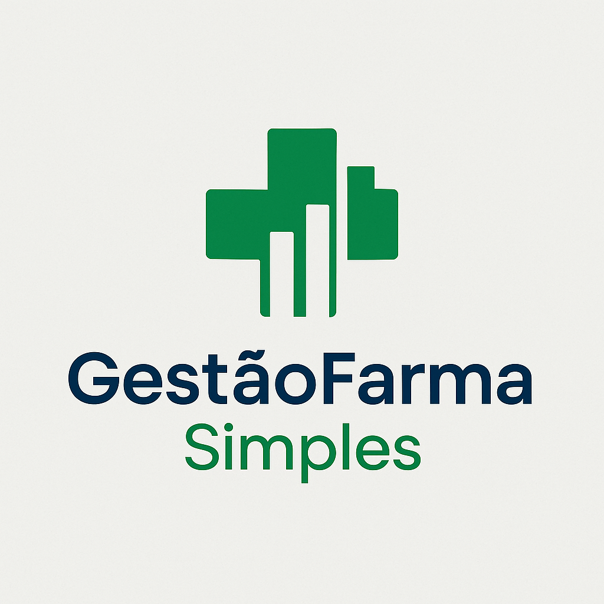

# 薬 GestaoFarma Simples — Sistema de Gestão para Farmácias

<p align="center">
  
</p>

<p align="center">
  
  
  
  
  
</p>

Sistema de gestão de estoque, vendas e usuários para pequenas farmácias, construído em Python. O projeto é um estudo de caso prático na aplicação de **princípios de arquitetura limpa (Clean Architecture)**, **SOLID** e **Design Patterns** para criar software robusto, testável e de fácil manutenção.

---

## 🏛️ Arquitetura e Design

O GestaoFarma Simples é construído sobre uma arquitetura em camadas desacoplada, garantindo que a lógica de negócios seja independente da interface e da persistência.

-   ✅ **Arquitetura Limpa (Clean Architecture):**
    * **Domínio/Modelos:** Entidades puras e Objetos de Valor (VOs) (`Product`, `Batch`, `User`, `Role`) que representam o núcleo do negócio.
    * **Repositórios (Persistence):** Camada de abstração (`ProductRepository`, `UserRepository`) que isola a lógica de negócios das consultas SQL (Padrão Repository).
    * **Serviços (Business Logic):** Orquestradores (`AuthService`, `NFEImporter`) que executam regras de negócios complexas, aplicando Inversão de Controle (IoC).
    * **UI/Infraestrutura:** Camada externa (`main.py`, `console_ui.py`, `database.py`) que lida com I/O e inicialização.

-   ✅ **Segurança (AuthN & AuthZ):**
    * **Autenticação (AuthN):** Armazenamento seguro de credenciais usando o algoritmo **PBKDF2 com Salt** (`hashlib.pbkdf2_hmac`) para proteção contra ataques de rainbow table.
    * **Autorização (AuthZ):** Implementação de fundação para **Role-Based Access Control (RBAC)**, permitindo controle de acesso granular (ex: Admin vs. Vendedor).

-   ✅ **Auditoria (Event Sourcing):**
    * Arquitetura de auditoria "Núcleo Indexado + Carga Flexível" através da tabela `events`. O `EventRepository` captura eventos de negócios (ex: `QUARANTINE_ADDED`) de forma desacoplada da lógica principal.

-   ✅ **Testes (TDD & BDD):**
    * Qualidade garantida por uma cultura de TDD com Pytest.
    * Testes de unidade isolados para Modelos, Validadores e Conversores.
    * Testes de integração para a camada de Repositório (com fixtures de banco de dados em memória) e Serviços (usando `unittest.mock` para isolar dependências).

-   ✅ **Funcionalidades de Negócio:**
    * Importação automatizada de NF-e (XML) com parsing robusto e persistência transacional de produtos e lotes.
    * Modelo de dados relacional (SQLite) com integridade referencial (FKs) e Chaves Primárias Compostas para garantir consistência.

---

## 🧱 Tecnologias Utilizadas

-   **Linguagem Principal:** Python 3.12+
-   **Testes:** Pytest, unittest.mock
-   **Banco de Dados:** SQLite
-   **Bibliotecas Externas:** `pwinput`
-   **Bibliotecas Padrão:** `xml.etree.ElementTree`, `datetime`, `hashlib`, `logging`, `sqlite3`

---

## 🚀 Como Executar

1.  Clone o projeto e entre na pasta:
    ```bash
    git clone [https://github.com/jotavitoraraujo/gestaoFarma_simples.git](https://github.com/jotavitoraraujo/gestaoFarma_simples.git)
    cd gestaoFarma_simples
    ```
2.  Crie e ative o ambiente virtual:
    ```bash
    py -m venv venv
    venv\Scripts\activate
    ```
3.  Instale as dependências:
    ```bash
    pip install -r requirements.txt
    ```
4.  Execute a aplicação:
    ```bash
    py main.py
    ```

---

## 🧪 Rodando os Testes

A suíte de testes é fundamental para garantir a integridade da arquitetura. Para executá-la:

```bash
pytest -vv
```

---

## 🧩 Estrutura do Projeto

```
gestaoFarma_simples/
├── system/
│   ├── models/             # Camada de Domínio (Entidades, VOs)
│   │   ├── __init__.py
│   │   ├── batch.py
│   │   ├── product.py
│   │   ├── user.py
│   │   └── rbac.py
│   ├── repositories/       # Camada de Persistência (Padrão Repository)
│   │   ├── __init__.py
│   │   ├── event_repository.py
│   │   ├── product_repository.py
│   │   └── user_repository.py
│   ├── services/           # Camada de Negócios (Orquestração)
│   │   ├── __init__.py
│   │   └── auth_service.py
│   ├── modules/            # Lógica de Aplicação (Ex: Parsers, Importadores)
│   │   ├── __init__.py
│   │   ├── nfe_importer.py
│   │   ├── xml_parser.py
│   │   ├── sales.py
│   │   ├── reports.py
│   │   └── settings_log.py
│   ├── ui/                 # Camada de Apresentação (I/O)
│   │   ├── __init__.py
│   │   └── console_ui.py
│   ├── utils/              # Funções puras (Validadores, Conversores)
│   │   ├── ...
│   ├── __init__.py
│   ├── database.py         # Infraestrutura de DB (Schema, Conexão)
│   └── security.py         # Infraestrutura de Criptografia
├── tests/
│   ├── tests_models/
│   │   └── ...
│   ├── tests_repositories/
│   │   └── ...
│   ├── tests_services/
│   │   └── ...
│   ├── tests_utils/
│   │   └── ...
│   ├── __init__.py
│   ├── conftest.py
│   └── ...
├── data/
│   └── farmacia.db         # Banco de dados SQLite
├── .gitignore
├── main.py                 # Ponto de Entrada (Inicialização)
├── README.md
└── requirements.txt
```

---

## 👨‍💻 Autor

Desenvolvido por **João Vitor Araújo** — Estudante de Análise e Desenvolvimento de Sistemas.

Venho de uma linhagem de construtores. Meu avô, era pedreiro; meu pai, o arquiteto e construtor de projetos complexos. Eles construíam com as mãos. Descobri que minha forma de construir é com código.

Este projeto nasceu dessa percepção. Após desenvolver um agente autônomo para análise de dados on-chain (`want33d`), voltei meu olhar para problemas do mundo real e identifiquei uma necessidade no negócio do meu pai. O GestãoFarma Simples é a aplicação da tecnologia com empatia, para resolver uma dor real com uma solução robusta, mas de simples utilização.

-   [LinkedIn](https://www.linkedin.com/in/joaoaraujo-dev/)
-   [GitHub](https://github.com/jotavitoraraujo)

---

## 📅 Histórico de Evolução

### Fase 4: AuthN/AuthZ e Camada de Serviços [EM ANDAMENTO]
* **Objetivo:** Implementar um sistema de autenticação e autorização robusto (Issue #30).
* **Marcos:**
    * `feat(security)`: Substituição de SHA-256 por **PBKDF2 com Salt**.
    * `feat(services)`: Criação da camada de Serviço (`AuthService`) e `UserRepository`, desacoplando a lógica de autenticação.
    * `refactor(persistence)`: Modularização do `database.py` por domínio (SRP).
    * `feat(models)`: Fundação do sistema **RBAC** com models (`Role`, `Permission`) e schema de banco de dados.

### Fase 3: Refatoração para Arquitetura Limpa [CONCLUÍDA]
* **Objetivo:** Pagar a dívida técnica da Fase 1/2 e estabelecer uma arquitetura testável e escalável.
* **Marcos:**
    * `refactor(arch)`: Implementação do **Padrão Repository** (`ProductRepository`) e **Injeção de Dependência** (`NFEImporter`).
    * `feat(audit)`: Criação do `EventRepository` para auditoria desacoplada.
    * `test(TDD)`: Criação da suíte de testes robusta com Pytest, cobrindo `utils`, `models` e `repositories`.

### Fase 1 & 2: Prova de Conceito (Código Procedural) [CONCLUÍDAS]
* **Objetivo:** Validar as funcionalidades principais (Importação de XML, Venda).
* **Marcos:**
    * `feat`: Implementação inicial do parser de XML e lógica de vendas procedural.
    * `feat`: Criação do schema relacional inicial (Produtos, Lotes).
---

## 📌 Observações Finais

O **GestãoFarma Simples** foi desenvolvido com o usuário final em mente: pessoas não técnicas que precisam de uma ferramenta que funcione de forma direta e sem complicações. A filosofia do projeto é priorizar a simplicidade na interface e a robustez na lógica de automação, resolvendo uma dor real do pequeno comerciante com tecnologia acessível.

A arquitetura de dados e de software está sendo desenhada para espelhar as melhores práticas da indústria, garantindo não apenas a simplicidade, mas também a precisão, a segurança e a integridade das informações do negócio a longo prazo.